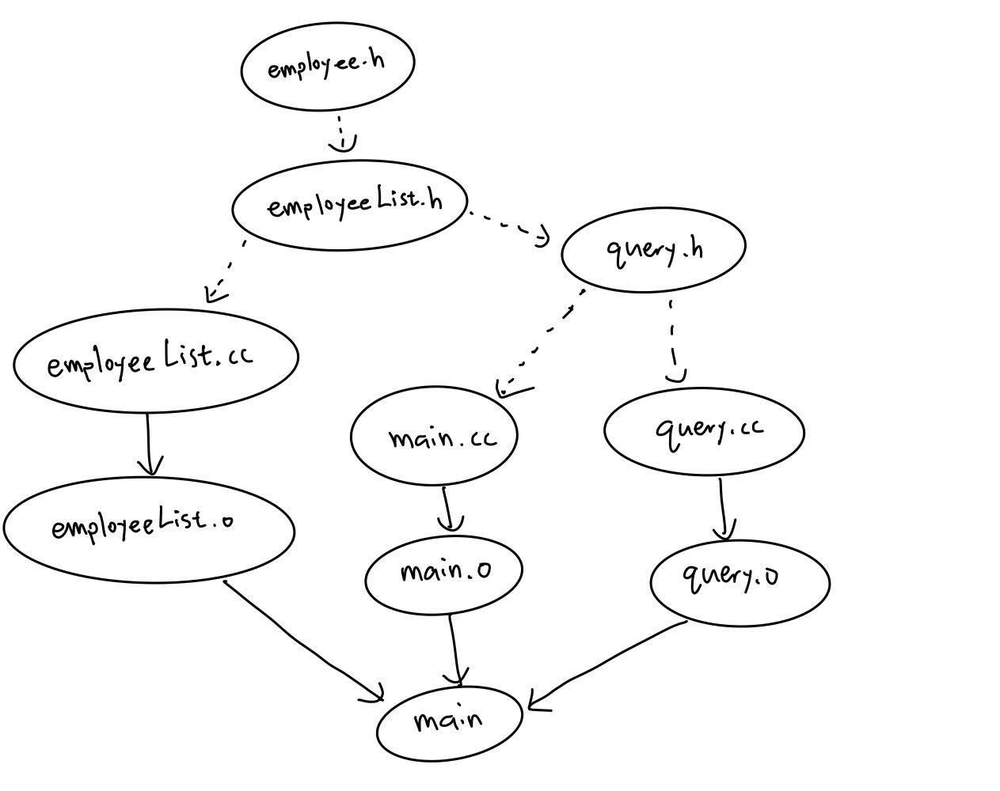

# OOP-Refactor

Refactor a submission to our judge system with all the techniques you have learned, and write a report with a GitHub public repository along with its refactor history. 

## Problem: 249. Company

